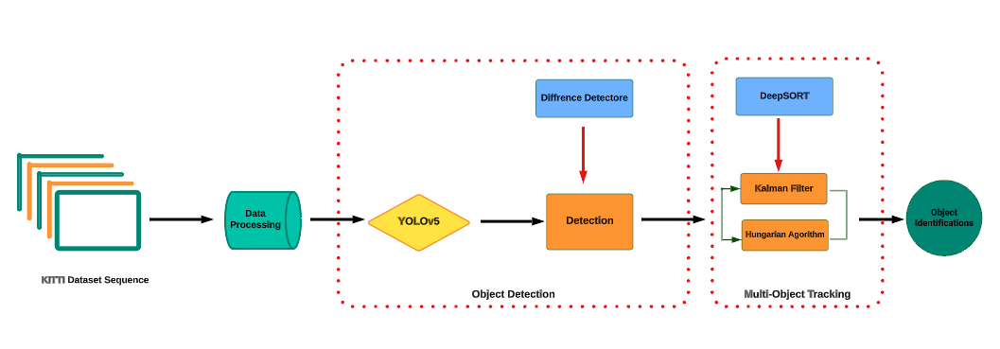

# Enhancing YOLOv5 Object Detection and Tracking Integrated with DeepSORT Algorithm for Autonomous Vehicles

Our project is creating an effective object detection and tracking system by successfully integrating YOLOv5 with DeepSORT. This combination has shown promising results in improving object detection consistency in video sequences.

The main code is based on [**YOLOv5 repository**](https://github.com/ultralytics/yolov5) and the [deep_sort_realtime](https://pypi.org/project/deep-sort-realtime/) package. Follow this **YOLOv5 repository** for installation.h

*Project Pipeline*

For further details, read the [CSE803_FINALPROJECT_REPORT.pdf](https://github.com/Kh-Hamed/Computer-Vision-Object-Detection/blob/master/CSE803_FINALPROJECT_REPORT%20.pdf) file.

-->

## 
License

Ultralytics offers two licensing options to accommodate diverse use cases:

- **AGPL-3.0 License**: This [OSI-approved](https://opensource.org/licenses/) open-source license is ideal for students and enthusiasts, promoting open collaboration and knowledge sharing. See the [LICENSE](https://github.com/ultralytics/yolov5/blob/master/LICENSE) file for more details.
- **Enterprise License**: Designed for commercial use, this license permits seamless integration of Ultralytics software and AI models into commercial goods and services, bypassing the open-source requirements of AGPL-3.0. If your scenario involves embedding our solutions into a commercial offering, reach out through [Ultralytics Licensing](https://ultralytics.com/license).

## 
Contact

For YOLOv5 bug reports and feature requests please visit [GitHub Issues](https://github.com/ultralytics/yolov5/issues), and join our [Discord](https://ultralytics.com/discord) community for questions and discussions!

 

  
  
  
  
  
  
  
  
  
  
  
  
  

[tta]: https://docs.ultralytics.com/yolov5/tutorials/test_time_augmentation
